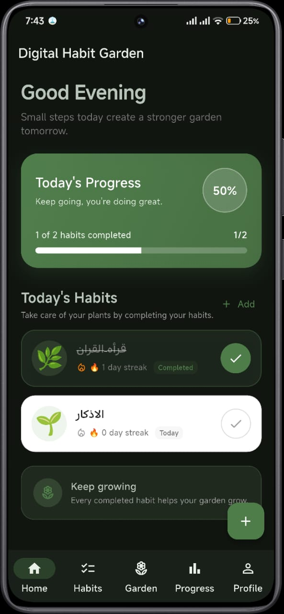
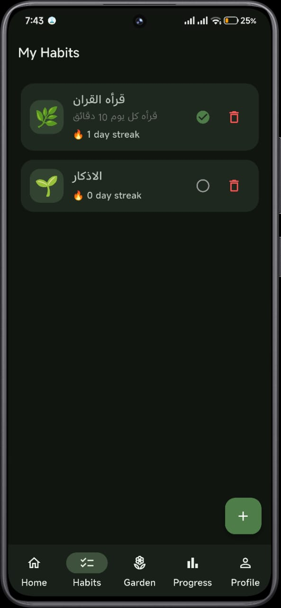
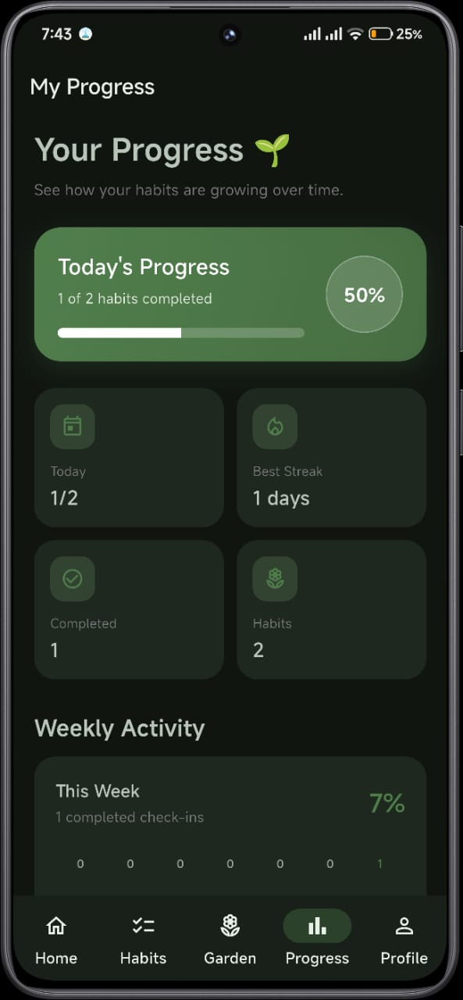
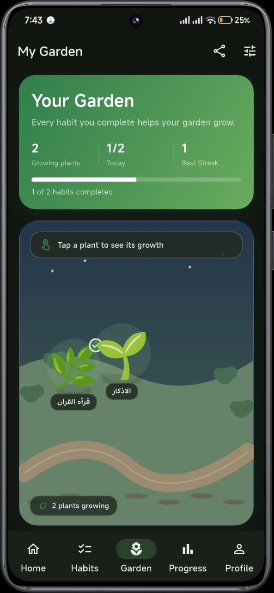
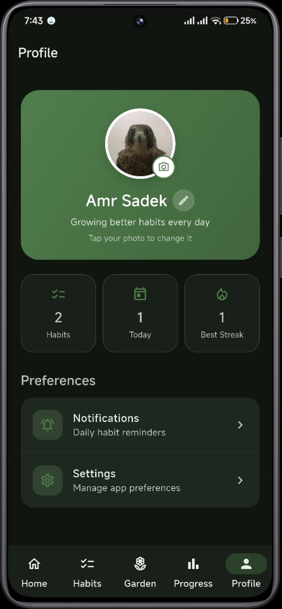
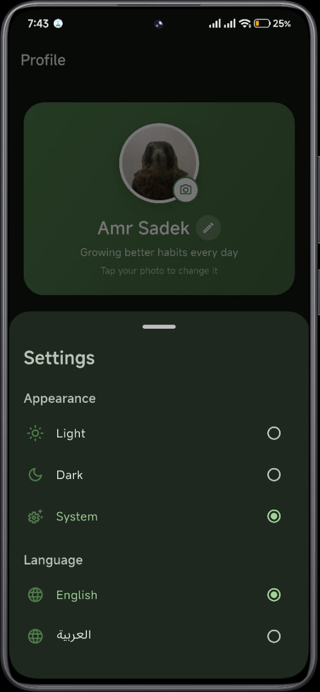

# 🌱 Digital Habit Garden

Digital Habit Garden is a Flutter mobile application that helps users build positive habits through a visual and interactive virtual garden.

Every completed habit contributes to the growth of a digital plant. Maintaining consistent habits builds streaks and unlocks new plant species, making habit tracking more engaging and motivating.

## ✨ Features

- 🌱 Create and track daily habits
- 🔥 Track habit streaks
- 🌿 Grow digital plants through habit completion
- 🌻 Unlock new plant species based on streak progress
- 🏡 Customize the garden with different themes
- 📊 Track weekly activity and progress
- 🔔 Daily habit reminders
- 🌙 Light and Dark themes
- 🌐 English and Arabic language support
- 📤 Share your garden

## 🛠️ Built With

- Flutter
- Dart
- SharedPreferences
- Flutter Local Notifications

## 🌱 How It Works

1. Create a habit.
2. Complete the habit each day.
3. Build and maintain your streak.
4. Watch your plant grow.
5. Unlock new plant species as your streak increases.
6. Customize your garden and track your progress.

## 📱 Screenshots

<table>
  <tr>
    <td align="center">
      
      <br>
      <b>Home</b>
    </td>
    <td align="center">
      
      <br>
      <b>Habits</b>
    </td>
  </tr>
  <tr>
    <td align="center">
      
      <br>
      <b>Progress</b>
    </td>
    <td align="center">
      
      <br>
      <b>Garden</b>
    </td>
  </tr>
  <tr>
    <td align="center">
      
      <br>
      <b>Profile</b>
    </td>
    <td align="center">
      
      <br>
      <b>Settings</b>
    </td>
  </tr>
</table>

## 📥 Download

The latest Android release is available here:

[Download Digital Habit Garden v1.0.0](https://github.com/Amr-Sadek/digital-habit-garden/releases/tag/v1.0.0)

## 🚀 Getting Started

### Requirements

- Flutter SDK
- Dart SDK
- Android Studio or another Flutter-compatible IDE

### Installation

Clone the repository:

```bash
git clone https://github.com/Amr-Sadek/digital-habit-garden.git
